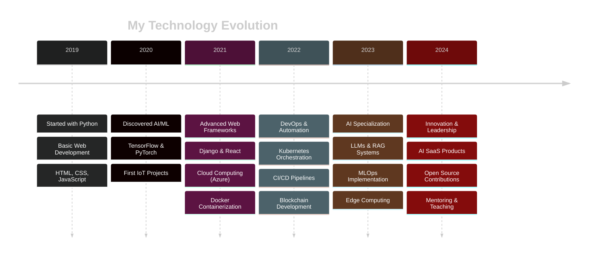

# 🌟 Welcome to My Digital Universe! 🌟

<div align="center">
  
  <!-- Animated Header -->
  
  
  <!-- Dynamic Typing Animation -->
  

  <!-- Animated Freelancer Badge -->
  <br><br>
  
  
  <!-- Animated Badges -->
  <br><br>
  [](https://www.linkedin.com/in/ibrahim-aloui-4a9186226/)
  [](https://github.com/IbrahimAL22)
  [](https://huggingface.co/IbrahimAL24)
  [](mailto:ibrahimaloui433@gmail.com)
  
  <!-- Animated Snake -->
  

  <!-- Interactive Skill Radar -->
  <br><br>
  <details>
  <summary>🎯 <b>Interactive Skill Radar</b> (Click to expand)</summary>
  <br>

  ```mermaid
  %%{init: {'theme':'dark'}}%%
  radar
      title Skills Radar
      "AI/ML" : 95
      "Web Dev" : 90
      "DevOps" : 85
      "IoT" : 88
      "Blockchain" : 80
      "Mobile" : 82
      "Cloud" : 87
      "Data Science" : 92
  ```

  </details>

  <!-- Dynamic Quote Generator -->
  <br>
  
  
</div>

---

## 🎭 The Story Behind The Code


Greetings, fellow code adventurer! 👋 I'm **Ibrahim Aloui**, a passionate **freelance technologist** from the beautiful coastal city of **Medenine, Tunisia** 🇹🇳. My journey in the digital realm began with a simple curiosity about how machines could think, learn, and solve problems just like humans do.

Today, I stand at the fascinating intersection of **Artificial Intelligence**, **Web Development**, and **Infrastructure Engineering**, crafting solutions that don't just work—they inspire, innovate, and transform the way we interact with technology.

<!-- Animated Freelancer Stats -->
<div align="center">
  
</div>

### 🌟 My Mission
> *"To bridge the gap between human creativity and machine intelligence, building technology that empowers people and solves real-world challenges through innovative freelance solutions."*

<!-- Animated Mission Statement -->
<div align="center">
  </div>

<div align="center">
  
  
  
  
  
</div>

---

## 🚀 Current Adventures & Explorations

<!-- Animated Section Header -->
<div align="center">
  
</div>

<br>

<div align="center">

  | 🔭 **Currently Working On** | 🌱 **Learning & Exploring** | ⚡ **Fun Fact** |
  |:---:|:---:|:---:|
  | 💼 Building next-gen AI applications for freelance clients | 🧠 Advanced MLOps pipelines and Kubernetes orchestration | I once built an AI that learned to make the perfect cup of coffee! ☕🤖 |
  | 🏠 Developing smart IoT ecosystems for sustainable living | 🌐 Exploring Web3 and decentralized applications | My smart home responds to my mood through biometric sensors 🏠💫 |
  | ⛓️ Creating blockchain solutions for real-world problems | 👁️ Diving deep into computer vision and edge computing | I speak 4 languages: Arabic, French, English, and Python! 🐍 |

  <!-- Animated Availability Status -->
  <br><br>
  

</div>

---

## 🛠️ Arsenal of Technologies

<!-- Animated Tech Stack Header -->
<div align="center">
  
</div>

<br>

<div align="center">

### 🧠 Artificial Intelligence & Machine Learning
<!-- Animated Skill Icons -->

<br>
<!-- Animated Progress Bars for AI Skills -->

<br><br>


### 🌐 Web Development & Frameworks

<br>
<!-- Animated Web Dev Skills -->

<br><br>


### 📱 Mobile Development

<br>
<!-- Animated Mobile Skills -->

<br><br>


### ⚙️ DevOps & Cloud Infrastructure

<br>
<!-- Animated DevOps Skills -->

<br><br>


### 🔌 IoT & Hardware

<br>


### ⛓️ Blockchain & Web3

<br>


### 🗄️ Databases & Storage


<!-- Interactive Tech Stack Journey -->
<details>
<summary>🚀 <b>My Tech Journey Timeline</b> (Click to explore)</summary>
<br>



</details>

</div>

---

## 🏆 Showcase of Innovation

<div align="center">

  

  <!-- Project Architecture Diagram -->
  <details>
  <summary>🏗️ <b>Project Architecture Overview</b> (Click to explore)</summary>
  <br>

  ```mermaid
  %%{init: {'theme':'dark'}}%%
  graph TD
      A[🧠 AI/ML Projects] --> B[📄 Document Assistant]
      A --> C[🅿️ Smart Parking]
      A --> D[🏠 IoT Ecosystem]

      B --> E[LangChain + RAG]
      B --> F[Hugging Face Models]

      C --> G[Computer Vision]
      C --> H[Blockchain Payments]

      D --> I[Smart Climate]
      D --> J[Intelligent Lighting]

      style A fill:#ff6b6b
      style B fill:#4ecdc4
      style C fill:#45b7d1
      style D fill:#96ceb4
  ```

  </details>

</div>

### 🤖 AI & Machine Learning Marvels

<table>
<tr>
<td width="50%">

#### 📄 **Intelligent Document Assistant**
*Where documents meet AI magic!*

```python
# The future of document interaction
def process_document(file):
    embeddings = create_embeddings(file)
    context = build_rag_pipeline(embeddings)
    return intelligent_response(context)
```

**🔧 Tech Arsenal:**
- 🧠 LangChain + ChromaDB
- 🤗 Hugging Face Transformers
- 🐍 Django + React.js
- 🐳 Docker Containerization

**✨ Features:**
- 💬 Contextual Q&A
- 📊 Document Summarization
- 🔍 Semantic Search
- 📈 Multi-format Support

</td>
<td width="50%">

#### 🅿️ **AI-Blockchain Parking System**
*Smart parking meets decentralized payments!*

```solidity
// Smart contract for transparent parking
contract ParkingPayment {
    function payForParking(uint duration) 
        public payable {
        // Automated payment processing
    }
}
```

**🔧 Tech Arsenal:**
- 👁️ YOLOv8 Computer Vision
- ⛓️ Solidity Smart Contracts
- 🍓 Raspberry Pi Edge Computing
- 🌐 Web3.js Integration

**✨ Features:**
- 🎯 Real-time Space Detection
- 💰 Transparent Pricing
- 🔒 Secure Payments
- 📊 Usage Analytics

</td>
</tr>
</table>

### 🏠 IoT & Smart Living Solutions

<table>
<tr>
<td width="50%">

#### 🌡️ **Smart Climate Control System**
*AI-powered comfort optimization!*

```python
# Predictive temperature control
class SmartThermostat:
    def __init__(self):
        self.ai_model = load_prediction_model()
    
    def optimize_temperature(self):
        weather = get_weather_data()
        occupancy = detect_occupancy()
        return self.ai_model.predict(weather, occupancy)
```

**🔧 Tech Arsenal:**
- 🧠 TensorFlow Predictions
- 🍓 Raspberry Pi Control
- 📱 Flutter Mobile App
- 🔥 Firebase Real-time DB
- 📡 MQTT Communication

**✨ Features:**
- 🎯 Occupancy Detection
- 🌤️ Weather Integration
- 📱 Remote Control
- ⚡ Energy Optimization
- 🗣️ Voice Commands

</td>
<td width="50%">

#### 💡 **Intelligent Lighting Ecosystem**
*Lights that learn and adapt!*

```cpp
// ESP32 adaptive lighting
void adaptLighting() {
    int ambientLight = analogRead(LIGHT_SENSOR);
    bool motionDetected = digitalRead(PIR_SENSOR);
    
    if (motionDetected) {
        adjustBrightnessAI(ambientLight);
    }
}
```

**🔧 Tech Arsenal:**
- 🔌 ESP32 Microcontrollers
- 🧠 TensorFlow Lite Edge AI
- 🔥 Firebase Integration
- 📡 MQTT Protocol
- 🎙️ Voice Control

**✨ Features:**
- 🕵️ Presence Detection
- 🌅 Natural Light Adaptation
- 🧠 Learning User Patterns
- 🎙️ Voice Activation
- 📊 Energy Monitoring

</td>
</tr>
</table>

---

## 📊 GitHub Analytics & Achievements

<div align="center">

  <!-- Enhanced GitHub Stats with Trophies -->
  

  <br><br>

  
  

  <!-- Interactive Language Stats -->
  <details>
  <summary>📈 <b>Detailed Language Analytics</b> (Click to expand)</summary>
  <br>

  

  

  </details>

  

  <!-- Enhanced Activity Graph -->
  

</div>

---

## 💼 Freelance Portfolio & Client Success Stories

<div align="center">

  <!-- Animated Freelance Stats -->
  

  <br><br>

  <!-- Client Satisfaction Metrics -->
  <table align="center">
  <tr>
    <td align="center" width="25%">
      
      <br><b>Perfect Rating</b><br>
      <sub>⭐⭐⭐⭐⭐ (5.0/5.0)</sub>
    </td>
    <td align="center" width="25%">
      
      <br><b>Successful Deliveries</b><br>
      <sub>On time & within budget</sub>
    </td>
    <td align="center" width="25%">
      
      <br><b>Quick Response</b><br>
      <sub>Fast communication</sub>
    </td>
    <td align="center" width="25%">
      
      <br><b>Client Retention</b><br>
      <sub>Long-term partnerships</sub>
    </td>
  </tr>
  </table>

</div>

---

## 🏆 Achievements & Certifications

<div align="center">
  
  
  
</div>

<table align="center">
<tr>
<td align="center" width="25%">
  
  <br><b>AI/ML Expert</b><br>
  <sub>5+ years in AI development</sub>
</td>
<td align="center" width="25%">
  
  <br><b>DevOps Professional</b><br>
  <sub>Cloud & Infrastructure</sub>
</td>
<td align="center" width="25%">
  
  <br><b>IoT Innovator</b><br>
  <sub>Smart system architect</sub>
</td>
<td align="center" width="25%">
  
  <br><b>Blockchain Developer</b><br>
  <sub>Web3 & Smart contracts</sub>
</td>
</tr>
</table>

---

## 🎯 Current Focus Areas & Goals

<div align="center">
  
  
  
</div>

<table>
<tr>
<td width="33%" align="center">
  
  ### 🔮 **2025 Goals**

  <!-- Animated Goals -->
  

  - 🚀 Launch 5 AI SaaS products for global clients
  - 📚 Master Advanced MLOps & AutoML pipelines
  - 🌍 Contribute to 50+ open-source projects
  - 🎓 Complete Kubernetes Expert certification
  - 🤝 Mentor 100+ aspiring developers
  - 💼 Expand freelance business internationally
  
</td>
<td width="33%" align="center">
  
  ### 🎯 **Current Learning**
  
  - 🧠 Advanced Transformer architectures
  - ☁️ Multi-cloud deployment strategies
  - 🔄 MLOps & ML lifecycle management
  - 🌐 Web3 & DeFi protocols
  - 📊 Advanced data engineering
  
</td>
<td width="33%" align="center">
  
  ### 💡 **Innovation Areas**
  
  - 🤖 AI-powered automation tools
  - 🏠 Smart city infrastructure
  - 🌱 Sustainable tech solutions
  - 🔒 Privacy-preserving AI
  - 🎮 AI in gaming & entertainment
  
</td>
</tr>
</table>

---

## 📈 Contribution Activity

<div align="center">
  
  
  
  
  
</div>

---

## 🤝 Let's Connect & Collaborate!

<div align="center">
  
  
  
  <br><br>
  
  <!-- Social Links with Hover Effects -->
  <a href="https://www.linkedin.com/in/ibrahim-aloui-4a9186226/">
    
  </a>
  <a href="https://github.com/IbrahimAL22">
    
  </a>
  <a href="https://huggingface.co/IbrahimAL24">
    
  </a>
  <a href="mailto:ibrahimaloui433@gmail.com">
    
  </a>
  
  <br><br>
  
  ### 💬 What I'm Open To:

  <!-- Animated Services -->
  

  <table align="center">
  <tr>
    <td align="center">🤝 <b>Collaboration</b><br><sub>Open source projects & innovations</sub></td>
    <td align="center">💼 <b>Freelance Work</b><br><sub>AI, Web, Mobile & DevOps projects</sub></td>
    <td align="center">🎓 <b>Mentoring</b><br><sub>Sharing knowledge & experience</sub></td>
    <td align="center">💡 <b>Consulting</b><br><sub>Technical architecture & strategy</sub></td>
  </tr>
  </table>
  
  <br>
  
  ### 🌟 Fun Ways to Connect:

  - 💬 **Ask me about:** AI/ML, IoT, Blockchain, or anything tech!
  - 🎯 **Challenge me with:** Complex problems that need creative solutions
  - 🚀 **Collaborate on:** Projects that can make a positive impact
  - ☕ **Chat about:** The future of technology over virtual coffee

  <!-- Interactive Contact Form -->
  <details>
  <summary>📝 <b>Quick Contact Form</b> (Click to expand)</summary>
  <br>

  ```markdown
  📧 Email Template for Collaboration:

  Subject: [Project/Collaboration] - [Your Name]

  Hi Ibrahim! 👋

  I found your GitHub profile and I'm interested in:
  [ ] Collaboration on an AI/ML project
  [ ] IoT system development
  [ ] Blockchain/Web3 consultation
  [ ] Mentoring opportunity
  [ ] Open source contribution
  [ ] Other: _______________

  Brief description of your idea/project:
  ________________________________

  Best time to connect:
  [ ] Morning (9-12 GMT+1)
  [ ] Afternoon (12-17 GMT+1)
  [ ] Evening (17-21 GMT+1)

  Looking forward to hearing from you!

  Best regards,
  [Your Name]
  ```

  </details>

  <!-- Response Time Indicator -->
  <br>
  
  
  

  <!-- Animated Freelancer Rates -->
  <br><br>
  

  <!-- Freelancer Service Packages -->
  <details>
  <summary>💼 <b>Freelance Service Packages</b> (Click to view pricing)</summary>
  <br>

  <table align="center">
  <tr>
    <td align="center" width="25%">
      
      <br><b>AI/ML Solutions</b><br>
      <sub>• Model Development<br>• Data Analysis<br>• Algorithm Optimization</sub>
    </td>
    <td align="center" width="25%">
      
      <br><b>Web Development</b><br>
      <sub>• Frontend + Backend<br>• Database Design<br>• API Development</sub>
    </td>
    <td align="center" width="25%">
      
      <br><b>DevOps & Cloud</b><br>
      <sub>• Infrastructure Setup<br>• CI/CD Pipelines<br>• Cloud Migration</sub>
    </td>
    <td align="center" width="25%">
      
      <br><b>End-to-End Projects</b><br>
      <sub>• Full System Design<br>• Implementation<br>• Maintenance</sub>
    </td>
  </tr>
  </table>

  </details>
  
</div>

---

<div align="center">
  
  
  
  ### 🙏 Thank You for Visiting!
  
  
  
  <br>
  
  
  
  
  <br>

  <!-- Interactive Quote Carousel -->
  <details>
  <summary>💭 <b>Inspirational Tech Quotes</b> (Click for more wisdom)</summary>
  <br>

  > *"The best way to predict the future is to invent it."* - **Alan Kay**

  > *"Code is like humor. When you have to explain it, it's bad."* - **Cory House**

  > *"First, solve the problem. Then, write the code."* - **John Johnson**

  > *"Any fool can write code that a computer can understand. Good programmers write code that humans can understand."* - **Martin Fowler**

  > *"The most important property of a program is whether it accomplishes the intention of its user."* - **C.A.R. Hoare**

  </details>

  <br>

  **"Code is poetry, and every line tells a story of innovation and possibility."**

  <!-- Visitor Counter -->
  

  <br><br>

  <sub>© 2025 Ibrahim Aloui - Freelance Developer Crafting the future, one commit at a time.</sub>
  
</div>
